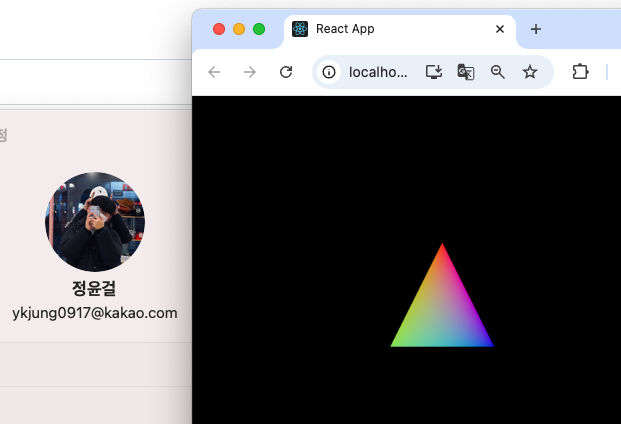

# r3f



# opengl


<details>
<summary>OpenGL 코드 펼치기/접기</summary>

```c++
// 20201507 정윤걸
#include <windows.h>
#include <GL/gl.h>
#pragma comment(lib, "opengl32.lib")

LRESULT CALLBACK WndProc(HWND h, UINT m, WPARAM w, LPARAM l) {
    if (m == WM_DESTROY) PostQuitMessage(0);
    return DefWindowProc(h, m, w, l);
}

int WINAPI WinMain(HINSTANCE h, HINSTANCE, LPSTR, int) {
    WNDCLASS wc = { CS_OWNDC, WndProc, 0, 0, h, 0, 0, 0, 0, L"GL" };
    RegisterClass(&wc);
    HWND win = CreateWindow(L"GL", 0, WS_OVERLAPPEDWINDOW | WS_VISIBLE, 100, 100, 800, 600, 0, 0, h, 0);
    HDC dc = GetDC(win);

    PIXELFORMATDESCRIPTOR pfd = { sizeof(pfd), 1, PFD_DRAW_TO_WINDOW | PFD_SUPPORT_OPENGL | PFD_DOUBLEBUFFER };
    SetPixelFormat(dc, ChoosePixelFormat(dc, &pfd), &pfd);
    HGLRC rc = wglCreateContext(dc);
    wglMakeCurrent(dc, rc);

    glMatrixMode(GL_PROJECTION); glLoadIdentity(); glOrtho(-1, 1, -1, 1, -1, 1);
    glMatrixMode(GL_MODELVIEW); glLoadIdentity();

    MSG msg = {};
    while (msg.message != WM_QUIT) {
        if (PeekMessage(&msg, 0, 0, 0, PM_REMOVE)) DispatchMessage(&msg);

        glBegin(GL_QUADS);
        // 왼쪽 상단: 빨강 (Red)
        glColor3f(1.0f, 0.0f, 0.0f);
        glVertex2f(-0.5f, 0.5f);

        // 오른쪽 상단: 노랑 (Yellow)
        glColor3f(1.0f, 1.0f, 0.0f);
        glVertex2f(0.5f, 0.5f);

        // 오른쪽 하단: 파랑 (Blue)
        glColor3f(0.0f, 0.0f, 1.0f);
        glVertex2f(0.5f, -0.5f);

        // 왼쪽 하단: 보라 (Violet)
        glColor3f(0.5f, 0.0f, 1.0f);
        glVertex2f(-0.5f, -0.5f);
        glEnd();


        SwapBuffers(dc);
        Sleep(16);
    }

    wglMakeCurrent(0, 0); wglDeleteContext(rc); ReleaseDC(win, dc); DestroyWindow(win);
    return 0;
}


```
</details>

# D3D


<details>
<summary>D3D 코드 펼치기/접기</summary>

```c++
// 20201507 정윤걸
#include <windows.h>
#include <d3d11.h>
#include <d3dcompiler.h>
#pragma comment(lib, "d3d11.lib")
#pragma comment(lib, "d3dcompiler.lib")

IDXGISwapChain* sc;
ID3D11Device* dev;
ID3D11DeviceContext* ctx;
ID3D11RenderTargetView* rtv;

// 정점 구조체
struct Vertex {
    float x, y;
    float u, v;
};

ID3D11VertexShader* vs;
ID3D11PixelShader* ps;
ID3D11Buffer* vb;
ID3D11InputLayout* il;

LRESULT CALLBACK WndProc(HWND h, UINT m, WPARAM w, LPARAM l) {
    if (m == WM_DESTROY) PostQuitMessage(0);
    return DefWindowProc(h, m, w, l);
}

int WINAPI WinMain(HINSTANCE h, HINSTANCE, LPSTR, int) {
    // 윈도우 클래스 등록 및 생성
    WNDCLASS wc = { CS_OWNDC, WndProc, 0, 0, h, 0, 0, 0, 0, L"D3D" };
    RegisterClass(&wc);
    HWND win = CreateWindow(L"D3D", 0, WS_OVERLAPPEDWINDOW | WS_VISIBLE,
        100, 100, 800, 600, 0, 0, h, 0);

    // 스왑체인 생성
    DXGI_SWAP_CHAIN_DESC sd = {};
    sd.BufferCount = 1;
    sd.BufferDesc.Format = DXGI_FORMAT_R8G8B8A8_UNORM;
    sd.BufferUsage = DXGI_USAGE_RENDER_TARGET_OUTPUT;
    sd.OutputWindow = win;
    sd.SampleDesc.Count = 1;
    sd.Windowed = TRUE;

    D3D11CreateDeviceAndSwapChain(
        0, D3D_DRIVER_TYPE_HARDWARE, 0, 0, 0, 0, D3D11_SDK_VERSION,
        &sd, &sc, &dev, 0, &ctx
    );

    // 렌더타겟 뷰 생성
    ID3D11Texture2D* bb;
    sc->GetBuffer(0, __uuidof(ID3D11Texture2D), (void**)&bb);
    dev->CreateRenderTargetView(bb, 0, &rtv);
    bb->Release();
    ctx->OMSetRenderTargets(1, &rtv, 0);

    // 뷰포트 설정
    D3D11_VIEWPORT vp = {};
    vp.Width = 800;
    vp.Height = 600;
    vp.MinDepth = 0.0f;
    vp.MaxDepth = 1.0f;
    vp.TopLeftX = 0;
    vp.TopLeftY = 0;
    ctx->RSSetViewports(1, &vp);

    // 전체 화면을 덮는 정점 데이터 (Triangle Strip)
    Vertex vertices[] = {
        { -1,  1, 0, 0 },  // 좌상단
        {  1,  1, 1, 0 },  // 우상단
        { -1, -1, 0, 1 },  // 좌하단
        {  1, -1, 1, 1 },  // 우하단
    };

    // 정점 버퍼 생성
    D3D11_BUFFER_DESC bd = {};
    bd.ByteWidth = sizeof(vertices);
    bd.Usage = D3D11_USAGE_DEFAULT;
    bd.BindFlags = D3D11_BIND_VERTEX_BUFFER;
    D3D11_SUBRESOURCE_DATA srd = {};
    srd.pSysMem = vertices;
    dev->CreateBuffer(&bd, &srd, &vb);

    // 셰이더 코드 (HLSL)
    const char* vsCode = R"(
        struct VS_OUT { float4 pos : SV_POSITION; float2 uv : TEXCOORD; };
        VS_OUT main(float2 pos : POSITION, float2 uv : TEXCOORD) {
            VS_OUT o;
            o.pos = float4(pos, 0, 1);
            o.uv = uv;
            return o;
        })";

    const char* psCode = R"(
        float4 main(float4 pos : SV_POSITION, float2 uv : TEXCOORD) : SV_TARGET {
            float t = uv.x; // X축 기준 그라데이션
            // HSV to RGB 변환의 단순화 버전 (무지개)
            float r = sin(t * 6.28318 + 0.0) * 0.5 + 0.5;
            float g = sin(t * 6.28318 + 2.094) * 0.5 + 0.5;
            float b = sin(t * 6.28318 + 4.188) * 0.5 + 0.5;
            return float4(r, g, b, 1.0);
        })";

    // 셰이더 컴파일
    ID3DBlob* vsBlob = nullptr, * psBlob = nullptr;
    D3DCompile(vsCode, strlen(vsCode), 0, 0, 0, "main", "vs_5_0", 0, 0, &vsBlob, 0);
    D3DCompile(psCode, strlen(psCode), 0, 0, 0, "main", "ps_5_0", 0, 0, &psBlob, 0);

    // 셰이더 객체 생성
    dev->CreateVertexShader(vsBlob->GetBufferPointer(), vsBlob->GetBufferSize(), 0, &vs);
    dev->CreatePixelShader(psBlob->GetBufferPointer(), psBlob->GetBufferSize(), 0, &ps);

    // 입력 레이아웃 생성
    D3D11_INPUT_ELEMENT_DESC layout[] = {
        { "POSITION", 0, DXGI_FORMAT_R32G32_FLOAT, 0, 0, D3D11_INPUT_PER_VERTEX_DATA, 0 },
        { "TEXCOORD", 0, DXGI_FORMAT_R32G32_FLOAT, 0, 8, D3D11_INPUT_PER_VERTEX_DATA, 0 },
    };
    dev->CreateInputLayout(layout, 2, vsBlob->GetBufferPointer(), vsBlob->GetBufferSize(), &il);

    // 컴파일된 셰이더 블롭 해제
    vsBlob->Release();
    psBlob->Release();

    // 메시지 루프
    MSG msg = {};
    while (msg.message != WM_QUIT) {
        if (PeekMessage(&msg, 0, 0, 0, PM_REMOVE)) DispatchMessage(&msg);

        // 배경 클리어
        float clear[4] = { 0, 0, 0, 1 };
        ctx->ClearRenderTargetView(rtv, clear);

        // 셰이더 및 버퍼 바인딩
        UINT stride = sizeof(Vertex), offset = 0;
        ctx->IASetVertexBuffers(0, 1, &vb, &stride, &offset);
        ctx->IASetInputLayout(il);
        ctx->VSSetShader(vs, 0, 0);
        ctx->PSSetShader(ps, 0, 0);
        ctx->IASetPrimitiveTopology(D3D11_PRIMITIVE_TOPOLOGY_TRIANGLESTRIP);

        // 사각형 그리기
        ctx->Draw(4, 0);

        sc->Present(1, 0);
    }

    // 리소스 해제
    vb->Release();
    vs->Release();
    ps->Release();
    il->Release();
    rtv->Release();
    sc->Release();
    ctx->Release();
    dev->Release();
    return 0;
}

```
</details>

# webGL


<details>
<summary>WebGL 코드 펼치기/접기</summary>

```html
<!DOCTYPE html>

<html lang="en">

<head>

<meta charset="UTF-8">

<title>Three.js 무지개빛 큐브 - 작은 창</title>

<style>

body { margin: 0; overflow: hidden; }

canvas {

position: absolute;

left: 0;

top: 0;

width: 320px;

height: 240px;

}

</style>

  

<script type="importmap">

{

"imports": {

"three": "https://cdn.jsdelivr.net/npm/three@0.160.0/build/three.module.js"

}

}

</script>

</head>

<body>

<script type="module">

import * as THREE from 'three';

  

// 기본 설정

const scene = new THREE.Scene();

const camera = new THREE.PerspectiveCamera(75, 320 / 240, 0.1, 1000); // 카메라 비율도 320:240 고정

const renderer = new THREE.WebGLRenderer({ antialias: true });

renderer.setSize(320, 240); // 320x240 고정

renderer.setClearColor('black'); // 배경색 변경

document.body.appendChild(renderer.domElement);

  

// 무지개빛 색상 재질을 위한 버텍스 쉐이더

const vertexShader = `

varying vec2 vUv;

void main() {

vUv = uv;

gl_Position = projectionMatrix * modelViewMatrix * vec4(position, 1.0);

}

`;

  

// 무지개빛 색상을 위한 프래그먼트 쉐이더

const fragmentShader = `

varying vec2 vUv;

void main() {

// 간단한 무지개 그라데이션 생성

vec3 rainbow;

rainbow.r = sin(vUv.x * 3.14159 * 2.0) * 0.5 + 0.5;

rainbow.g = sin(vUv.y * 3.14159 * 2.0) * 0.5 + 0.5;

rainbow.b = sin((vUv.x + vUv.y) * 3.14159) * 0.5 + 0.5;

gl_FragColor = vec4(rainbow, 1.0);

}

`;

  

// 큐브 만들기

const geometry = new THREE.BoxGeometry(2, 2, 2);

const material = new THREE.ShaderMaterial({

uniforms: {},

vertexShader: vertexShader,

fragmentShader: fragmentShader

});

const cube = new THREE.Mesh(geometry, material);

scene.add(cube);

  

// 큐브를 45도(x, y축) 회전

cube.rotation.x = Math.PI / 4;

cube.rotation.y = Math.PI / 4;

  

// 조명 추가

const light = new THREE.DirectionalLight(0xffffff, 1);

light.position.set(5, 5, 5);

scene.add(light);

  

const ambientLight = new THREE.AmbientLight(0x404040);

scene.add(ambientLight);

  

// 카메라 위치 조정

camera.position.set(0, 0, 5);

  

// 애니메이션

function animate() {

requestAnimationFrame(animate);

// 큐브 회전

cube.rotation.x += 0.01;

cube.rotation.y += 0.01;

renderer.render(scene, camera);

}

  

animate();

</script>

</body>

</html>
```
</details>

# webgpu


<details>
<summary>WebGPU 코드 펼치기/접기</summary>

```html
<!DOCTYPE html>

<html lang="en">

<head>

<meta charset="utf-8" />

<title>Three.js WebGPU Test - 무지개빛 큐브</title>

<style>

body { margin: 0; overflow: hidden; }

</style>

  

<!-- Import map for CDN -->

<script type="importmap">

{

"imports": {

"three": "https://cdn.jsdelivr.net/npm/three@0.160.0/build/three.module.js",

"three/addons/": "https://cdn.jsdelivr.net/npm/three@0.160.0/examples/jsm/"

}

}

</script>

</head>

  

<body>

<script type="module">

import * as THREE from 'three';

import { OrbitControls } from 'three/addons/controls/OrbitControls.js';

import WebGPURenderer from 'three/addons/renderers/webgpu/WebGPURenderer.js'; // ✅ default import

  

// WebGPU 지원 확인

function isWebGPUSupported() {

return !!navigator.gpu;

}

  

if (isWebGPUSupported()) {

const renderer = new WebGPURenderer();

renderer.setSize(window.innerWidth, window.innerHeight);

document.body.appendChild(renderer.domElement);

  

const scene = new THREE.Scene();

scene.background = new THREE.Color(0x000000); // 배경을 검정색으로 변경

  

const camera = new THREE.PerspectiveCamera(70, window.innerWidth / window.innerHeight, 0.1, 100);

camera.position.z = 3;

  

const controls = new OrbitControls(camera, renderer.domElement);

controls.enableDamping = true;

  

// 무지개 색상 텍스처 생성

const size = 256;

const data = new Uint8Array(4 * size * size);

for (let y = 0; y < size; y++) {

for (let x = 0; x < size; x++) {

const i = (y * size + x) * 4;

// 무지개 패턴 만들기

data[i] = Math.sin((x / size) * Math.PI * 2) * 127 + 128; // R

data[i + 1] = Math.sin((y / size) * Math.PI * 2) * 127 + 128; // G

data[i + 2] = Math.sin(((x + y) / size) * Math.PI) * 127 + 128; // B

data[i + 3] = 255; // A

}

}

const rainbowTexture = new THREE.DataTexture(data, size, size, THREE.RGBAFormat);

rainbowTexture.needsUpdate = true;

  

// 큐브 생성

const geometry = new THREE.BoxGeometry(1, 1, 1, 10, 10, 10); // 세분화된 큐브 생성

const material = new THREE.MeshPhysicalMaterial({

map: rainbowTexture,

roughness: 0.2,

metalness: 0.8,

reflectivity: 1.0,

clearcoat: 1.0,

clearcoatRoughness: 0.2

});

const cube = new THREE.Mesh(geometry, material);

scene.add(cube);

  

// 주변광 추가

const ambientLight = new THREE.AmbientLight(0xaaaaaa); // 밝기를 높이기 위해 주변광의 강도를 증가

scene.add(ambientLight);

  

// 조명

const light = new THREE.DirectionalLight(0xffffff, 1);

light.position.set(5, 5, 5);

scene.add(light);

  

// 반대쪽에도 조명 추가하여 더 화려한 효과 - 더 밝게

const light2 = new THREE.DirectionalLight(0xffffff, 1.5); // 조명 강도 증가

light2.position.set(-5, -5, -5);

scene.add(light2);

  

// 윈도우 크기 변경 처리

window.addEventListener('resize', () => {

camera.aspect = window.innerWidth / window.innerHeight;

camera.updateProjectionMatrix();

renderer.setSize(window.innerWidth, window.innerHeight);

});

  

function animate() {

requestAnimationFrame(animate);

cube.rotation.x += 0.005;

cube.rotation.y += 0.01;

controls.update();

renderer.render(scene, camera);

}

  

animate();

} else {

document.body.innerHTML = `<h2 style="color:red;">WebGPU not supported in this browser.</h2>`;

}

</script>

</body>

</html>
```
</details>

# vulkan


<details>
<summary>Vulkan 코드 펼치기/접기</summary>

```c++
//20201507 정윤걸
#define GLFW_INCLUDE_VULKAN
#include <GLFW/glfw3.h>

#include <iostream>
#include <fstream>
#include <stdexcept>
#include <algorithm>
#include <vector>
#include <cstring>
#include <cstdlib>
#include <cstdint>
#include <limits>
#include <optional>
#include <set>

const uint32_t WIDTH = 800;
const uint32_t HEIGHT = 600;

const int MAX_FRAMES_IN_FLIGHT = 2;

const std::vector<const char*> validationLayers = {
    "VK_LAYER_KHRONOS_validation"
};

const std::vector<const char*> deviceExtensions = {
    VK_KHR_SWAPCHAIN_EXTENSION_NAME
};

#ifdef NDEBUG
const bool enableValidationLayers = false;
#else
const bool enableValidationLayers = true;
#endif

VkResult CreateDebugUtilsMessengerEXT(VkInstance instance, const VkDebugUtilsMessengerCreateInfoEXT* pCreateInfo, const VkAllocationCallbacks* pAllocator, VkDebugUtilsMessengerEXT* pDebugMessenger) {
    auto func = (PFN_vkCreateDebugUtilsMessengerEXT)vkGetInstanceProcAddr(instance, "vkCreateDebugUtilsMessengerEXT");
    if (func != nullptr) {
        return func(instance, pCreateInfo, pAllocator, pDebugMessenger);
    }
    else {
        return VK_ERROR_EXTENSION_NOT_PRESENT;
    }
}

void DestroyDebugUtilsMessengerEXT(VkInstance instance, VkDebugUtilsMessengerEXT debugMessenger, const VkAllocationCallbacks* pAllocator) {
    auto func = (PFN_vkDestroyDebugUtilsMessengerEXT)vkGetInstanceProcAddr(instance, "vkDestroyDebugUtilsMessengerEXT");
    if (func != nullptr) {
        func(instance, debugMessenger, pAllocator);
    }
}

struct QueueFamilyIndices {
    std::optional<uint32_t> graphicsFamily;
    std::optional<uint32_t> presentFamily;

    bool isComplete() {
        return graphicsFamily.has_value() && presentFamily.has_value();
    }
};

struct SwapChainSupportDetails {
    VkSurfaceCapabilitiesKHR capabilities;
    std::vector<VkSurfaceFormatKHR> formats;
    std::vector<VkPresentModeKHR> presentModes;
};

class HelloTriangleApplication {
public:
    void run() {
        initWindow();
        initVulkan();
        mainLoop();
        cleanup();
    }

private:
    GLFWwindow* window;

    VkInstance instance;
    VkDebugUtilsMessengerEXT debugMessenger;
    VkSurfaceKHR surface;

    VkPhysicalDevice physicalDevice = VK_NULL_HANDLE;
    VkDevice device;

    VkQueue graphicsQueue;
    VkQueue presentQueue;

    VkSwapchainKHR swapChain;
    std::vector<VkImage> swapChainImages;
    VkFormat swapChainImageFormat;
    VkExtent2D swapChainExtent;
    std::vector<VkImageView> swapChainImageViews;
    std::vector<VkFramebuffer> swapChainFramebuffers;

    VkRenderPass renderPass;
    VkPipelineLayout pipelineLayout;
    VkPipeline graphicsPipeline;

    VkCommandPool commandPool;
    std::vector<VkCommandBuffer> commandBuffers;

    std::vector<VkSemaphore> imageAvailableSemaphores;
    std::vector<VkSemaphore> renderFinishedSemaphores;
    std::vector<VkFence> inFlightFences;
    uint32_t currentFrame = 0;

    void initWindow() {
        glfwInit();

        glfwWindowHint(GLFW_CLIENT_API, GLFW_NO_API);
        glfwWindowHint(GLFW_RESIZABLE, GLFW_FALSE);

        window = glfwCreateWindow(WIDTH, HEIGHT, "Vulkan", nullptr, nullptr);
    }

    void initVulkan() {
        createInstance();
        setupDebugMessenger();
        createSurface();
        pickPhysicalDevice();
        createLogicalDevice();
        createSwapChain();
        createImageViews();
        createRenderPass();
        createGraphicsPipeline();
        createFramebuffers();
        createCommandPool();
        createCommandBuffers();
        createSyncObjects();
    }

    void mainLoop() {
        while (!glfwWindowShouldClose(window)) {
            glfwPollEvents();
            drawFrame();
        }

        vkDeviceWaitIdle(device);
    }

    void cleanup() {
        for (size_t i = 0; i < MAX_FRAMES_IN_FLIGHT; i++) {
            vkDestroySemaphore(device, renderFinishedSemaphores[i], nullptr);
            vkDestroySemaphore(device, imageAvailableSemaphores[i], nullptr);
            vkDestroyFence(device, inFlightFences[i], nullptr);
        }

        vkDestroyCommandPool(device, commandPool, nullptr);

        for (auto framebuffer : swapChainFramebuffers) {
            vkDestroyFramebuffer(device, framebuffer, nullptr);
        }

        vkDestroyPipeline(device, graphicsPipeline, nullptr);
        vkDestroyPipelineLayout(device, pipelineLayout, nullptr);
        vkDestroyRenderPass(device, renderPass, nullptr);

        for (auto imageView : swapChainImageViews) {
            vkDestroyImageView(device, imageView, nullptr);
        }

        vkDestroySwapchainKHR(device, swapChain, nullptr);
        vkDestroyDevice(device, nullptr);

        if (enableValidationLayers) {
            DestroyDebugUtilsMessengerEXT(instance, debugMessenger, nullptr);
        }

        vkDestroySurfaceKHR(instance, surface, nullptr);
        vkDestroyInstance(instance, nullptr);

        glfwDestroyWindow(window);

        glfwTerminate();
    }

    void createInstance() {
        if (enableValidationLayers && !checkValidationLayerSupport()) {
            throw std::runtime_error("validation layers requested, but not available!");
        }

        VkApplicationInfo appInfo{};
        appInfo.sType = VK_STRUCTURE_TYPE_APPLICATION_INFO;
        appInfo.pApplicationName = "Hello Triangle";
        appInfo.applicationVersion = VK_MAKE_VERSION(1, 0, 0);
        appInfo.pEngineName = "No Engine";
        appInfo.engineVersion = VK_MAKE_VERSION(1, 0, 0);
        appInfo.apiVersion = VK_API_VERSION_1_0;

        VkInstanceCreateInfo createInfo{};
        createInfo.sType = VK_STRUCTURE_TYPE_INSTANCE_CREATE_INFO;
        createInfo.pApplicationInfo = &appInfo;

        auto extensions = getRequiredExtensions();
        createInfo.enabledExtensionCount = static_cast<uint32_t>(extensions.size());
        createInfo.ppEnabledExtensionNames = extensions.data();

        VkDebugUtilsMessengerCreateInfoEXT debugCreateInfo{};
        if (enableValidationLayers) {
            createInfo.enabledLayerCount = static_cast<uint32_t>(validationLayers.size());
            createInfo.ppEnabledLayerNames = validationLayers.data();

            populateDebugMessengerCreateInfo(debugCreateInfo);
            createInfo.pNext = (VkDebugUtilsMessengerCreateInfoEXT*)&debugCreateInfo;
        }
        else {
            createInfo.enabledLayerCount = 0;

            createInfo.pNext = nullptr;
        }

        if (vkCreateInstance(&createInfo, nullptr, &instance) != VK_SUCCESS) {
            throw std::runtime_error("failed to create instance!");
        }
    }

    void populateDebugMessengerCreateInfo(VkDebugUtilsMessengerCreateInfoEXT& createInfo) {
        createInfo = {};
        createInfo.sType = VK_STRUCTURE_TYPE_DEBUG_UTILS_MESSENGER_CREATE_INFO_EXT;
        createInfo.messageSeverity = VK_DEBUG_UTILS_MESSAGE_SEVERITY_VERBOSE_BIT_EXT | VK_DEBUG_UTILS_MESSAGE_SEVERITY_WARNING_BIT_EXT | VK_DEBUG_UTILS_MESSAGE_SEVERITY_ERROR_BIT_EXT;
        createInfo.messageType = VK_DEBUG_UTILS_MESSAGE_TYPE_GENERAL_BIT_EXT | VK_DEBUG_UTILS_MESSAGE_TYPE_VALIDATION_BIT_EXT | VK_DEBUG_UTILS_MESSAGE_TYPE_PERFORMANCE_BIT_EXT;
        createInfo.pfnUserCallback = debugCallback;
    }

    void setupDebugMessenger() {
        if (!enableValidationLayers) return;

        VkDebugUtilsMessengerCreateInfoEXT createInfo;
        populateDebugMessengerCreateInfo(createInfo);

        if (CreateDebugUtilsMessengerEXT(instance, &createInfo, nullptr, &debugMessenger) != VK_SUCCESS) {
            throw std::runtime_error("failed to set up debug messenger!");
        }
    }

    void createSurface() {
        if (glfwCreateWindowSurface(instance, window, nullptr, &surface) != VK_SUCCESS) {
            throw std::runtime_error("failed to create window surface!");
        }
    }

    void pickPhysicalDevice() {
        uint32_t deviceCount = 0;
        vkEnumeratePhysicalDevices(instance, &deviceCount, nullptr);

        if (deviceCount == 0) {
            throw std::runtime_error("failed to find GPUs with Vulkan support!");
        }

        std::vector<VkPhysicalDevice> devices(deviceCount);
        vkEnumeratePhysicalDevices(instance, &deviceCount, devices.data());

        for (const auto& device : devices) {
            if (isDeviceSuitable(device)) {
                physicalDevice = device;
                break;
            }
        }

        if (physicalDevice == VK_NULL_HANDLE) {
            throw std::runtime_error("failed to find a suitable GPU!");
        }
    }

    void createLogicalDevice() {
        QueueFamilyIndices indices = findQueueFamilies(physicalDevice);

        std::vector<VkDeviceQueueCreateInfo> queueCreateInfos;
        std::set<uint32_t> uniqueQueueFamilies = { indices.graphicsFamily.value(), indices.presentFamily.value() };

        float queuePriority = 1.0f;
        for (uint32_t queueFamily : uniqueQueueFamilies) {
            VkDeviceQueueCreateInfo queueCreateInfo{};
            queueCreateInfo.sType = VK_STRUCTURE_TYPE_DEVICE_QUEUE_CREATE_INFO;
            queueCreateInfo.queueFamilyIndex = queueFamily;
            queueCreateInfo.queueCount = 1;
            queueCreateInfo.pQueuePriorities = &queuePriority;
            queueCreateInfos.push_back(queueCreateInfo);
        }

        VkPhysicalDeviceFeatures deviceFeatures{};

        VkDeviceCreateInfo createInfo{};
        createInfo.sType = VK_STRUCTURE_TYPE_DEVICE_CREATE_INFO;

        createInfo.queueCreateInfoCount = static_cast<uint32_t>(queueCreateInfos.size());
        createInfo.pQueueCreateInfos = queueCreateInfos.data();

        createInfo.pEnabledFeatures = &deviceFeatures;

        createInfo.enabledExtensionCount = static_cast<uint32_t>(deviceExtensions.size());
        createInfo.ppEnabledExtensionNames = deviceExtensions.data();

        if (vkCreateDevice(physicalDevice, &createInfo, nullptr, &device) != VK_SUCCESS) {
            throw std::runtime_error("failed to create logical device!");
        }

        vkGetDeviceQueue(device, indices.graphicsFamily.value(), 0, &graphicsQueue);
        vkGetDeviceQueue(device, indices.presentFamily.value(), 0, &presentQueue);
    }

    void createSwapChain() {
        SwapChainSupportDetails swapChainSupport = querySwapChainSupport(physicalDevice);

        VkSurfaceFormatKHR surfaceFormat = chooseSwapSurfaceFormat(swapChainSupport.formats);
        VkPresentModeKHR presentMode = chooseSwapPresentMode(swapChainSupport.presentModes);
        VkExtent2D extent = chooseSwapExtent(swapChainSupport.capabilities);

        uint32_t imageCount = swapChainSupport.capabilities.minImageCount + 1;
        if (swapChainSupport.capabilities.maxImageCount > 0 && imageCount > swapChainSupport.capabilities.maxImageCount) {
            imageCount = swapChainSupport.capabilities.maxImageCount;
        }

        VkSwapchainCreateInfoKHR createInfo{};
        createInfo.sType = VK_STRUCTURE_TYPE_SWAPCHAIN_CREATE_INFO_KHR;
        createInfo.surface = surface;

        createInfo.minImageCount = imageCount;
        createInfo.imageFormat = surfaceFormat.format;
        createInfo.imageColorSpace = surfaceFormat.colorSpace;
        createInfo.imageExtent = extent;
        createInfo.imageArrayLayers = 1;
        createInfo.imageUsage = VK_IMAGE_USAGE_COLOR_ATTACHMENT_BIT;

        QueueFamilyIndices indices = findQueueFamilies(physicalDevice);
        uint32_t queueFamilyIndices[] = { indices.graphicsFamily.value(), indices.presentFamily.value() };

        if (indices.graphicsFamily != indices.presentFamily) {
            createInfo.imageSharingMode = VK_SHARING_MODE_CONCURRENT;
            createInfo.queueFamilyIndexCount = 2;
            createInfo.pQueueFamilyIndices = queueFamilyIndices;
        }
        else {
            createInfo.imageSharingMode = VK_SHARING_MODE_EXCLUSIVE;
        }

        createInfo.preTransform = swapChainSupport.capabilities.currentTransform;
        createInfo.compositeAlpha = VK_COMPOSITE_ALPHA_OPAQUE_BIT_KHR;
        createInfo.presentMode = presentMode;
        createInfo.clipped = VK_TRUE;

        createInfo.oldSwapchain = VK_NULL_HANDLE;

        if (vkCreateSwapchainKHR(device, &createInfo, nullptr, &swapChain) != VK_SUCCESS) {
            throw std::runtime_error("failed to create swap chain!");
        }

        vkGetSwapchainImagesKHR(device, swapChain, &imageCount, nullptr);
        swapChainImages.resize(imageCount);
        vkGetSwapchainImagesKHR(device, swapChain, &imageCount, swapChainImages.data());

        swapChainImageFormat = surfaceFormat.format;
        swapChainExtent = extent;
    }

    void createImageViews() {
        swapChainImageViews.resize(swapChainImages.size());

        for (size_t i = 0; i < swapChainImages.size(); i++) {
            VkImageViewCreateInfo createInfo{};
            createInfo.sType = VK_STRUCTURE_TYPE_IMAGE_VIEW_CREATE_INFO;
            createInfo.image = swapChainImages[i];
            createInfo.viewType = VK_IMAGE_VIEW_TYPE_2D;
            createInfo.format = swapChainImageFormat;
            createInfo.components.r = VK_COMPONENT_SWIZZLE_IDENTITY;
            createInfo.components.g = VK_COMPONENT_SWIZZLE_IDENTITY;
            createInfo.components.b = VK_COMPONENT_SWIZZLE_IDENTITY;
            createInfo.components.a = VK_COMPONENT_SWIZZLE_IDENTITY;
            createInfo.subresourceRange.aspectMask = VK_IMAGE_ASPECT_COLOR_BIT;
            createInfo.subresourceRange.baseMipLevel = 0;
            createInfo.subresourceRange.levelCount = 1;
            createInfo.subresourceRange.baseArrayLayer = 0;
            createInfo.subresourceRange.layerCount = 1;

            if (vkCreateImageView(device, &createInfo, nullptr, &swapChainImageViews[i]) != VK_SUCCESS) {
                throw std::runtime_error("failed to create image views!");
            }
        }
    }

    void createRenderPass() {
        VkAttachmentDescription colorAttachment{};
        colorAttachment.format = swapChainImageFormat;
        colorAttachment.samples = VK_SAMPLE_COUNT_1_BIT;
        colorAttachment.loadOp = VK_ATTACHMENT_LOAD_OP_CLEAR;
        colorAttachment.storeOp = VK_ATTACHMENT_STORE_OP_STORE;
        colorAttachment.stencilLoadOp = VK_ATTACHMENT_LOAD_OP_DONT_CARE;
        colorAttachment.stencilStoreOp = VK_ATTACHMENT_STORE_OP_DONT_CARE;
        colorAttachment.initialLayout = VK_IMAGE_LAYOUT_UNDEFINED;
        colorAttachment.finalLayout = VK_IMAGE_LAYOUT_PRESENT_SRC_KHR;

        VkAttachmentReference colorAttachmentRef{};
        colorAttachmentRef.attachment = 0;
        colorAttachmentRef.layout = VK_IMAGE_LAYOUT_COLOR_ATTACHMENT_OPTIMAL;

        VkSubpassDescription subpass{};
        subpass.pipelineBindPoint = VK_PIPELINE_BIND_POINT_GRAPHICS;
        subpass.colorAttachmentCount = 1;
        subpass.pColorAttachments = &colorAttachmentRef;

        VkSubpassDependency dependency{};
        dependency.srcSubpass = VK_SUBPASS_EXTERNAL;
        dependency.dstSubpass = 0;
        dependency.srcStageMask = VK_PIPELINE_STAGE_COLOR_ATTACHMENT_OUTPUT_BIT;
        dependency.srcAccessMask = 0;
        dependency.dstStageMask = VK_PIPELINE_STAGE_COLOR_ATTACHMENT_OUTPUT_BIT;
        dependency.dstAccessMask = VK_ACCESS_COLOR_ATTACHMENT_WRITE_BIT;

        VkRenderPassCreateInfo renderPassInfo{};
        renderPassInfo.sType = VK_STRUCTURE_TYPE_RENDER_PASS_CREATE_INFO;
        renderPassInfo.attachmentCount = 1;
        renderPassInfo.pAttachments = &colorAttachment;
        renderPassInfo.subpassCount = 1;
        renderPassInfo.pSubpasses = &subpass;
        renderPassInfo.dependencyCount = 1;
        renderPassInfo.pDependencies = &dependency;

        if (vkCreateRenderPass(device, &renderPassInfo, nullptr, &renderPass) != VK_SUCCESS) {
            throw std::runtime_error("failed to create render pass!");
        }
    }

    void createGraphicsPipeline() {
        auto vertShaderCode = readFile("C:/Users/NGNLAB/source/repos/vulkan/vulkan/shaders/vert.spv");
        auto fragShaderCode = readFile("C:/Users/NGNLAB/source/repos/vulkan/vulkan/shaders/frag.spv");

        VkShaderModule vertShaderModule = createShaderModule(vertShaderCode);
        VkShaderModule fragShaderModule = createShaderModule(fragShaderCode);

        VkPipelineShaderStageCreateInfo vertShaderStageInfo{};
        vertShaderStageInfo.sType = VK_STRUCTURE_TYPE_PIPELINE_SHADER_STAGE_CREATE_INFO;
        vertShaderStageInfo.stage = VK_SHADER_STAGE_VERTEX_BIT;
        vertShaderStageInfo.module = vertShaderModule;
        vertShaderStageInfo.pName = "main";

        VkPipelineShaderStageCreateInfo fragShaderStageInfo{};
        fragShaderStageInfo.sType = VK_STRUCTURE_TYPE_PIPELINE_SHADER_STAGE_CREATE_INFO;
        fragShaderStageInfo.stage = VK_SHADER_STAGE_FRAGMENT_BIT;
        fragShaderStageInfo.module = fragShaderModule;
        fragShaderStageInfo.pName = "main";

        VkPipelineShaderStageCreateInfo shaderStages[] = { vertShaderStageInfo, fragShaderStageInfo };

        VkPipelineVertexInputStateCreateInfo vertexInputInfo{};
        vertexInputInfo.sType = VK_STRUCTURE_TYPE_PIPELINE_VERTEX_INPUT_STATE_CREATE_INFO;
        vertexInputInfo.vertexBindingDescriptionCount = 0;
        vertexInputInfo.vertexAttributeDescriptionCount = 0;

        VkPipelineInputAssemblyStateCreateInfo inputAssembly{};
        inputAssembly.sType = VK_STRUCTURE_TYPE_PIPELINE_INPUT_ASSEMBLY_STATE_CREATE_INFO;
        inputAssembly.topology = VK_PRIMITIVE_TOPOLOGY_TRIANGLE_LIST;
        inputAssembly.primitiveRestartEnable = VK_FALSE;

        VkPipelineViewportStateCreateInfo viewportState{};
        viewportState.sType = VK_STRUCTURE_TYPE_PIPELINE_VIEWPORT_STATE_CREATE_INFO;
        viewportState.viewportCount = 1;
        viewportState.scissorCount = 1;

        VkPipelineRasterizationStateCreateInfo rasterizer{};
        rasterizer.sType = VK_STRUCTURE_TYPE_PIPELINE_RASTERIZATION_STATE_CREATE_INFO;
        rasterizer.depthClampEnable = VK_FALSE;
        rasterizer.rasterizerDiscardEnable = VK_FALSE;
        rasterizer.polygonMode = VK_POLYGON_MODE_FILL;
        rasterizer.lineWidth = 1.0f;
        rasterizer.cullMode = VK_CULL_MODE_NONE;
        rasterizer.frontFace = VK_FRONT_FACE_CLOCKWISE;
        rasterizer.depthBiasEnable = VK_FALSE;

        VkPipelineMultisampleStateCreateInfo multisampling{};
        multisampling.sType = VK_STRUCTURE_TYPE_PIPELINE_MULTISAMPLE_STATE_CREATE_INFO;
        multisampling.sampleShadingEnable = VK_FALSE;
        multisampling.rasterizationSamples = VK_SAMPLE_COUNT_1_BIT;

        VkPipelineColorBlendAttachmentState colorBlendAttachment{};
        colorBlendAttachment.colorWriteMask = VK_COLOR_COMPONENT_R_BIT | VK_COLOR_COMPONENT_G_BIT | VK_COLOR_COMPONENT_B_BIT | VK_COLOR_COMPONENT_A_BIT;
        colorBlendAttachment.blendEnable = VK_TRUE;
        colorBlendAttachment.srcColorBlendFactor = VK_BLEND_FACTOR_SRC_ALPHA;
        colorBlendAttachment.dstColorBlendFactor = VK_BLEND_FACTOR_ONE_MINUS_SRC_ALPHA;
        colorBlendAttachment.colorBlendOp = VK_BLEND_OP_ADD;
        colorBlendAttachment.srcAlphaBlendFactor = VK_BLEND_FACTOR_ONE;
        colorBlendAttachment.dstAlphaBlendFactor = VK_BLEND_FACTOR_ZERO;
        colorBlendAttachment.alphaBlendOp = VK_BLEND_OP_ADD;

        VkPipelineColorBlendStateCreateInfo colorBlending{};
        colorBlending.sType = VK_STRUCTURE_TYPE_PIPELINE_COLOR_BLEND_STATE_CREATE_INFO;
        colorBlending.logicOpEnable = VK_FALSE;
        colorBlending.logicOp = VK_LOGIC_OP_COPY;
        colorBlending.attachmentCount = 1;
        colorBlending.pAttachments = &colorBlendAttachment;
        colorBlending.blendConstants[0] = 0.0f;
        colorBlending.blendConstants[1] = 0.0f;
        colorBlending.blendConstants[2] = 0.0f;
        colorBlending.blendConstants[3] = 0.0f;

        std::vector<VkDynamicState> dynamicStates = {
            VK_DYNAMIC_STATE_VIEWPORT,
            VK_DYNAMIC_STATE_SCISSOR
        };
        VkPipelineDynamicStateCreateInfo dynamicState{};
        dynamicState.sType = VK_STRUCTURE_TYPE_PIPELINE_DYNAMIC_STATE_CREATE_INFO;
        dynamicState.dynamicStateCount = static_cast<uint32_t>(dynamicStates.size());
        dynamicState.pDynamicStates = dynamicStates.data();

        VkPipelineLayoutCreateInfo pipelineLayoutInfo{};
        pipelineLayoutInfo.sType = VK_STRUCTURE_TYPE_PIPELINE_LAYOUT_CREATE_INFO;
        pipelineLayoutInfo.setLayoutCount = 0;
        pipelineLayoutInfo.pushConstantRangeCount = 0;

        if (vkCreatePipelineLayout(device, &pipelineLayoutInfo, nullptr, &pipelineLayout) != VK_SUCCESS) {
            throw std::runtime_error("failed to create pipeline layout!");
        }

        VkGraphicsPipelineCreateInfo pipelineInfo{};
        pipelineInfo.sType = VK_STRUCTURE_TYPE_GRAPHICS_PIPELINE_CREATE_INFO;
        pipelineInfo.stageCount = 2;
        pipelineInfo.pStages = shaderStages;
        pipelineInfo.pVertexInputState = &vertexInputInfo;
        pipelineInfo.pInputAssemblyState = &inputAssembly;
        pipelineInfo.pViewportState = &viewportState;
        pipelineInfo.pRasterizationState = &rasterizer;
        pipelineInfo.pMultisampleState = &multisampling;
        pipelineInfo.pColorBlendState = &colorBlending;
        pipelineInfo.pDynamicState = &dynamicState;
        pipelineInfo.layout = pipelineLayout;
        pipelineInfo.renderPass = renderPass;
        pipelineInfo.subpass = 0;
        pipelineInfo.basePipelineHandle = VK_NULL_HANDLE;

        if (vkCreateGraphicsPipelines(device, VK_NULL_HANDLE, 1, &pipelineInfo, nullptr, &graphicsPipeline) != VK_SUCCESS) {
            throw std::runtime_error("failed to create graphics pipeline!");
        }

        vkDestroyShaderModule(device, fragShaderModule, nullptr);
        vkDestroyShaderModule(device, vertShaderModule, nullptr);
    }

    void createFramebuffers() {
        swapChainFramebuffers.resize(swapChainImageViews.size());

        for (size_t i = 0; i < swapChainImageViews.size(); i++) {
            VkImageView attachments[] = {
                swapChainImageViews[i]
            };

            VkFramebufferCreateInfo framebufferInfo{};
            framebufferInfo.sType = VK_STRUCTURE_TYPE_FRAMEBUFFER_CREATE_INFO;
            framebufferInfo.renderPass = renderPass;
            framebufferInfo.attachmentCount = 1;
            framebufferInfo.pAttachments = attachments;
            framebufferInfo.width = swapChainExtent.width;
            framebufferInfo.height = swapChainExtent.height;
            framebufferInfo.layers = 1;

            if (vkCreateFramebuffer(device, &framebufferInfo, nullptr, &swapChainFramebuffers[i]) != VK_SUCCESS) {
                throw std::runtime_error("failed to create framebuffer!");
            }
        }
    }

    void createCommandPool() {
        QueueFamilyIndices queueFamilyIndices = findQueueFamilies(physicalDevice);

        VkCommandPoolCreateInfo poolInfo{};
        poolInfo.sType = VK_STRUCTURE_TYPE_COMMAND_POOL_CREATE_INFO;
        poolInfo.flags = VK_COMMAND_POOL_CREATE_RESET_COMMAND_BUFFER_BIT;
        poolInfo.queueFamilyIndex = queueFamilyIndices.graphicsFamily.value();

        if (vkCreateCommandPool(device, &poolInfo, nullptr, &commandPool) != VK_SUCCESS) {
            throw std::runtime_error("failed to create command pool!");
        }
    }

    void createCommandBuffers() {
        commandBuffers.resize(MAX_FRAMES_IN_FLIGHT);

        VkCommandBufferAllocateInfo allocInfo{};
        allocInfo.sType = VK_STRUCTURE_TYPE_COMMAND_BUFFER_ALLOCATE_INFO;
        allocInfo.commandPool = commandPool;
        allocInfo.level = VK_COMMAND_BUFFER_LEVEL_PRIMARY;
        allocInfo.commandBufferCount = (uint32_t)commandBuffers.size();

        if (vkAllocateCommandBuffers(device, &allocInfo, commandBuffers.data()) != VK_SUCCESS) {
            throw std::runtime_error("failed to allocate command buffers!");
        }
    }

    void recordCommandBuffer(VkCommandBuffer commandBuffer, uint32_t imageIndex) {
        VkCommandBufferBeginInfo beginInfo{};
        beginInfo.sType = VK_STRUCTURE_TYPE_COMMAND_BUFFER_BEGIN_INFO;

        if (vkBeginCommandBuffer(commandBuffer, &beginInfo) != VK_SUCCESS) {
            throw std::runtime_error("failed to begin recording command buffer!");
        }

        VkRenderPassBeginInfo renderPassInfo{};
        renderPassInfo.sType = VK_STRUCTURE_TYPE_RENDER_PASS_BEGIN_INFO;
        renderPassInfo.renderPass = renderPass;
        renderPassInfo.framebuffer = swapChainFramebuffers[imageIndex];
        renderPassInfo.renderArea.offset = { 0, 0 };
        renderPassInfo.renderArea.extent = swapChainExtent;

        VkClearValue clearColor = { {{0.0f, 0.0f, 0.0f, 1.0f}} };
        renderPassInfo.clearValueCount = 1;
        renderPassInfo.pClearValues = &clearColor;

        vkCmdBeginRenderPass(commandBuffer, &renderPassInfo, VK_SUBPASS_CONTENTS_INLINE);

        vkCmdBindPipeline(commandBuffer, VK_PIPELINE_BIND_POINT_GRAPHICS, graphicsPipeline);

        VkViewport viewport{};
        viewport.x = 0.0f;
        viewport.y = 0.0f;
        viewport.width = (float)swapChainExtent.width;
        viewport.height = (float)swapChainExtent.height;
        viewport.minDepth = 0.0f;
        viewport.maxDepth = 1.0f;
        vkCmdSetViewport(commandBuffer, 0, 1, &viewport);

        VkRect2D scissor{};
        scissor.offset = { 0, 0 };
        scissor.extent = swapChainExtent;
        vkCmdSetScissor(commandBuffer, 0, 1, &scissor);

        vkCmdDraw(commandBuffer, 6, 1, 0, 0);

        vkCmdEndRenderPass(commandBuffer);

        if (vkEndCommandBuffer(commandBuffer) != VK_SUCCESS) {
            throw std::runtime_error("failed to record command buffer!");
        }
    }

    void createSyncObjects() {
        imageAvailableSemaphores.resize(MAX_FRAMES_IN_FLIGHT);
        renderFinishedSemaphores.resize(MAX_FRAMES_IN_FLIGHT);
        inFlightFences.resize(MAX_FRAMES_IN_FLIGHT);

        VkSemaphoreCreateInfo semaphoreInfo{};
        semaphoreInfo.sType = VK_STRUCTURE_TYPE_SEMAPHORE_CREATE_INFO;

        VkFenceCreateInfo fenceInfo{};
        fenceInfo.sType = VK_STRUCTURE_TYPE_FENCE_CREATE_INFO;
        fenceInfo.flags = VK_FENCE_CREATE_SIGNALED_BIT;

        for (size_t i = 0; i < MAX_FRAMES_IN_FLIGHT; i++) {
            if (vkCreateSemaphore(device, &semaphoreInfo, nullptr, &imageAvailableSemaphores[i]) != VK_SUCCESS ||
                vkCreateSemaphore(device, &semaphoreInfo, nullptr, &renderFinishedSemaphores[i]) != VK_SUCCESS ||
                vkCreateFence(device, &fenceInfo, nullptr, &inFlightFences[i]) != VK_SUCCESS) {
                throw std::runtime_error("failed to create synchronization objects for a frame!");
            }
        }
    }

    void drawFrame() {
        vkWaitForFences(device, 1, &inFlightFences[currentFrame], VK_TRUE, UINT64_MAX);
        vkResetFences(device, 1, &inFlightFences[currentFrame]);

        uint32_t imageIndex;
        vkAcquireNextImageKHR(device, swapChain, UINT64_MAX, imageAvailableSemaphores[currentFrame], VK_NULL_HANDLE, &imageIndex);

        vkResetCommandBuffer(commandBuffers[currentFrame], /*VkCommandBufferResetFlagBits*/ 0);
        recordCommandBuffer(commandBuffers[currentFrame], imageIndex);

        VkSubmitInfo submitInfo{};
        submitInfo.sType = VK_STRUCTURE_TYPE_SUBMIT_INFO;

        VkSemaphore waitSemaphores[] = { imageAvailableSemaphores[currentFrame] };
        VkPipelineStageFlags waitStages[] = { VK_PIPELINE_STAGE_COLOR_ATTACHMENT_OUTPUT_BIT };
        submitInfo.waitSemaphoreCount = 1;
        submitInfo.pWaitSemaphores = waitSemaphores;
        submitInfo.pWaitDstStageMask = waitStages;

        submitInfo.commandBufferCount = 1;
        submitInfo.pCommandBuffers = &commandBuffers[currentFrame];

        VkSemaphore signalSemaphores[] = { renderFinishedSemaphores[currentFrame] };
        submitInfo.signalSemaphoreCount = 1;
        submitInfo.pSignalSemaphores = signalSemaphores;

        if (vkQueueSubmit(graphicsQueue, 1, &submitInfo, inFlightFences[currentFrame]) != VK_SUCCESS) {
            throw std::runtime_error("failed to submit draw command buffer!");
        }

        VkPresentInfoKHR presentInfo{};
        presentInfo.sType = VK_STRUCTURE_TYPE_PRESENT_INFO_KHR;

        presentInfo.waitSemaphoreCount = 1;
        presentInfo.pWaitSemaphores = signalSemaphores;

        VkSwapchainKHR swapChains[] = { swapChain };
        presentInfo.swapchainCount = 1;
        presentInfo.pSwapchains = swapChains;

        presentInfo.pImageIndices = &imageIndex;

        vkQueuePresentKHR(presentQueue, &presentInfo);

        currentFrame = (currentFrame + 1) % MAX_FRAMES_IN_FLIGHT;
    }

    VkShaderModule createShaderModule(const std::vector<char>& code) {
        VkShaderModuleCreateInfo createInfo{};
        createInfo.sType = VK_STRUCTURE_TYPE_SHADER_MODULE_CREATE_INFO;
        createInfo.codeSize = code.size();
        createInfo.pCode = reinterpret_cast<const uint32_t*>(code.data());

        VkShaderModule shaderModule;
        if (vkCreateShaderModule(device, &createInfo, nullptr, &shaderModule) != VK_SUCCESS) {
            throw std::runtime_error("failed to create shader module!");
        }

        return shaderModule;
    }

    VkSurfaceFormatKHR chooseSwapSurfaceFormat(const std::vector<VkSurfaceFormatKHR>& availableFormats) {
        for (const auto& availableFormat : availableFormats) {
            if (availableFormat.format == VK_FORMAT_B8G8R8A8_SRGB && availableFormat.colorSpace == VK_COLOR_SPACE_SRGB_NONLINEAR_KHR) {
                return availableFormat;
            }
        }

        return availableFormats[0];
    }

    VkPresentModeKHR chooseSwapPresentMode(const std::vector<VkPresentModeKHR>& availablePresentModes) {
        for (const auto& availablePresentMode : availablePresentModes) {
            if (availablePresentMode == VK_PRESENT_MODE_MAILBOX_KHR) {
                return availablePresentMode;
            }
        }

        return VK_PRESENT_MODE_FIFO_KHR;
    }

    VkExtent2D chooseSwapExtent(const VkSurfaceCapabilitiesKHR& capabilities) {
        if (capabilities.currentExtent.width != std::numeric_limits<uint32_t>::max()) {
            return capabilities.currentExtent;
        }
        else {
            int width, height;
            glfwGetFramebufferSize(window, &width, &height);

            VkExtent2D actualExtent = {
                static_cast<uint32_t>(width),
                static_cast<uint32_t>(height)
            };

            actualExtent.width = std::clamp(actualExtent.width, capabilities.minImageExtent.width, capabilities.maxImageExtent.width);
            actualExtent.height = std::clamp(actualExtent.height, capabilities.minImageExtent.height, capabilities.maxImageExtent.height);

            return actualExtent;
        }
    }

    SwapChainSupportDetails querySwapChainSupport(VkPhysicalDevice device) {
        SwapChainSupportDetails details;

        vkGetPhysicalDeviceSurfaceCapabilitiesKHR(device, surface, &details.capabilities);

        uint32_t formatCount;
        vkGetPhysicalDeviceSurfaceFormatsKHR(device, surface, &formatCount, nullptr);

        if (formatCount != 0) {
            details.formats.resize(formatCount);
            vkGetPhysicalDeviceSurfaceFormatsKHR(device, surface, &formatCount, details.formats.data());
        }

        uint32_t presentModeCount;
        vkGetPhysicalDeviceSurfacePresentModesKHR(device, surface, &presentModeCount, nullptr);

        if (presentModeCount != 0) {
            details.presentModes.resize(presentModeCount);
            vkGetPhysicalDeviceSurfacePresentModesKHR(device, surface, &presentModeCount, details.presentModes.data());
        }

        return details;
    }

    bool isDeviceSuitable(VkPhysicalDevice device) {
        QueueFamilyIndices indices = findQueueFamilies(device);

        bool extensionsSupported = checkDeviceExtensionSupport(device);

        bool swapChainAdequate = false;
        if (extensionsSupported) {
            SwapChainSupportDetails swapChainSupport = querySwapChainSupport(device);
            swapChainAdequate = !swapChainSupport.formats.empty() && !swapChainSupport.presentModes.empty();
        }

        return indices.isComplete() && extensionsSupported && swapChainAdequate;
    }

    bool checkDeviceExtensionSupport(VkPhysicalDevice device) {
        uint32_t extensionCount;
        vkEnumerateDeviceExtensionProperties(device, nullptr, &extensionCount, nullptr);

        std::vector<VkExtensionProperties> availableExtensions(extensionCount);
        vkEnumerateDeviceExtensionProperties(device, nullptr, &extensionCount, availableExtensions.data());

        std::set<std::string> requiredExtensions(deviceExtensions.begin(), deviceExtensions.end());

        for (const auto& extension : availableExtensions) {
            requiredExtensions.erase(extension.extensionName);
        }

        return requiredExtensions.empty();
    }

    QueueFamilyIndices findQueueFamilies(VkPhysicalDevice device) {
        QueueFamilyIndices indices;

        uint32_t queueFamilyCount = 0;
        vkGetPhysicalDeviceQueueFamilyProperties(device, &queueFamilyCount, nullptr);

        std::vector<VkQueueFamilyProperties> queueFamilies(queueFamilyCount);
        vkGetPhysicalDeviceQueueFamilyProperties(device, &queueFamilyCount, queueFamilies.data());

        int i = 0;
        for (const auto& queueFamily : queueFamilies) {
            if (queueFamily.queueFlags & VK_QUEUE_GRAPHICS_BIT) {
                indices.graphicsFamily = i;
            }

            VkBool32 presentSupport = false;
            vkGetPhysicalDeviceSurfaceSupportKHR(device, i, surface, &presentSupport);

            if (presentSupport) {
                indices.presentFamily = i;
            }

            if (indices.isComplete()) {
                break;
            }

            i++;
        }

        return indices;
    }

    std::vector<const char*> getRequiredExtensions() {
        uint32_t glfwExtensionCount = 0;
        const char** glfwExtensions;
        glfwExtensions = glfwGetRequiredInstanceExtensions(&glfwExtensionCount);

        std::vector<const char*> extensions(glfwExtensions, glfwExtensions + glfwExtensionCount);

        if (enableValidationLayers) {
            extensions.push_back(VK_EXT_DEBUG_UTILS_EXTENSION_NAME);
        }

        return extensions;
    }

    bool checkValidationLayerSupport() {
        uint32_t layerCount;
        vkEnumerateInstanceLayerProperties(&layerCount, nullptr);

        std::vector<VkLayerProperties> availableLayers(layerCount);
        vkEnumerateInstanceLayerProperties(&layerCount, availableLayers.data());

        for (const char* layerName : validationLayers) {
            bool layerFound = false;

            for (const auto& layerProperties : availableLayers) {
                if (strcmp(layerName, layerProperties.layerName) == 0) {
                    layerFound = true;
                    break;
                }
            }

            if (!layerFound) {
                return false;
            }
        }

        return true;
    }

    static std::vector<char> readFile(const std::string& filename) {
        std::ifstream file(filename, std::ios::ate | std::ios::binary);

        if (!file.is_open()) {
            throw std::runtime_error("failed to open file: " + filename);
        }

        size_t fileSize = (size_t)file.tellg();
        std::vector<char> buffer(fileSize);

        file.seekg(0);
        file.read(buffer.data(), fileSize);

        file.close();

        return buffer;
    }

    static VKAPI_ATTR VkBool32 VKAPI_CALL debugCallback(VkDebugUtilsMessageSeverityFlagBitsEXT messageSeverity, VkDebugUtilsMessageTypeFlagsEXT messageType, const VkDebugUtilsMessengerCallbackDataEXT* pCallbackData, void* pUserData) {
        std::cerr << "validation layer: " << pCallbackData->pMessage << std::endl;

        return VK_FALSE;
    }
};

int main() {
    HelloTriangleApplication app;

    try {
        app.run();
    }
    catch (const std::exception& e) {
        std::cerr << e.what() << std::endl;
        return EXIT_FAILURE;
    }

    return EXIT_SUCCESS;
}
```
</details>

# Vulkan Shader
<details>
<summary>Shader.vert 코드 펼치기/접기</summary>

```glsl
// shader.vert
#version 450

layout(location = 0) out vec3 fragColor;

vec2 positions[6] = vec2[](
    vec2(-0.5, -0.5),  // 첫 번째 삼각형 - 왼쪽 하단
    vec2(0.5, -0.5),   // 첫 번째 삼각형 - 오른쪽 하단
    vec2(0.5, 0.5),    // 첫 번째 삼각형 - 오른쪽 상단
    vec2(0.5, 0.5),    // 두 번째 삼각형 - 오른쪽 상단
    vec2(-0.5, 0.5),   // 두 번째 삼각형 - 왼쪽 상단
    vec2(-0.5, -0.5)   // 두 번째 삼각형 - 왼쪽 하단
);

// 각 꼭지점에 색상 지정 (코너에 색상 배치)
vec3 colors[6] = vec3[](
    vec3(1.0, 0.0, 0.0),  // 왼쪽 하단 - 빨강
    vec3(0.0, 1.0, 0.0),  // 오른쪽 하단 - 초록
    vec3(0.0, 0.0, 1.0),  // 오른쪽 상단 - 파랑
    vec3(0.0, 0.0, 1.0),  // 오른쪽 상단 - 파랑 (같은 위치, 같은 색상)
    vec3(1.0, 1.0, 0.0),  // 왼쪽 상단 - 노랑
    vec3(1.0, 0.0, 0.0)   // 왼쪽 하단 - 빨강 (같은 위치, 같은 색상)
);

void main() {
    gl_Position = vec4(positions[gl_VertexIndex], 0.0, 1.0);
    fragColor = colors[gl_VertexIndex];
}
```
</details>
